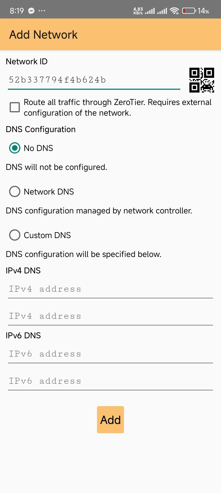

## I. Mô tả
Đèn thông minh sử dụng chuẩn Matter over Thread, tích hợp với Home Assistant thông qua ESP32 Thread Border Router. Thiết bị hoạt động như một Thread End Device, hỗ trợ điều khiển ánh sáng và phản hồi trạng thái theo thời gian thực.
## II. Chi tiết
### 1. Thread Border Router
#### 1.1. Một số lưu ý
- Phần cứng sử dụng là ESP Thread Border Router Board (**ESP TBR**) (gồm host SoC ESP32-S3 và RCP ESP32-H2)
   

- Phiên bản ESP-IDF được khuyên dùng là v5.2.4

   ```git clone -b v5.2.4 --recursive https://github.com/espressif/esp-idf.git```
- Repository dành cho ESP32-S3

   ```git clone --recursive https://github.com/espressif/esp-thread-br.git```
##
#### 1.2. Cấu hình các thành phần
- Cấu hình RCP: Sử dụng example có sẵn trong ```esp-idf/examples/openthread/ot_rcp```.
- Cấu hình Border Router
   - Sử dụng example có sẵn trong ```esp-thread-br/examples/basic_thread_border_router```.
   - Sử dụng lệnh ```idf.py menuconfig``` để cấu hình sâu:
      - Kích thước ...: 8MB.
      - SSID, Password cho Wifi mặc định.
      - OpenThread:
         - Điều chỉnh thông tin mạng Thread (Tên, PanID, Channel, Mật khẩu mạng Thread, ...).
         - Bật chế độ Commissioner, Joiner.
         - Bật chế độ tự khởi động Thread, giao diện Web Server.
         - Bật chế độ Command Line Interface (CLI) - Giao tiếp qua lệnh trên monitor.
- Build, flash. Border Router sẽ tự động tìm dến thư mục chứa file đã build của RCP để flash cùng.
##
#### 1.3. Kiểm tra hệ thống
##### 1.3.1. ESP TBR - Thread End Device (TED)
- Lấy Thread network dataset trên Border Router ```dataset active -x```.
- Trên monitor hiện
<pre>> dataset active -x
0e080000000000010000000300001335060004001fffe00208dead00beef00cafe0708fdfaeb6813db063b0510112233445566778899aabbccddeeff00030f4f70656e5468726561642d34396436010212340410104810e2315100afd6bc9215a6bfac530c0402a0f7f8
Done</pre>
- Thêm dataset trên cho TED
<pre>> dataset set active 0e080000000000010000000300001335060004001fffe00208dead00beef00cafe0708fdfaeb6813db063b0510112233445566778899aabbccddeeff00030f4f70656e5468726561642d34396436010212340410104810e2315100afd6bc9215a6bfac530c0402a0f7f8
Done
> dataset commit active
Done
> ifconfig up
Done
I (1665530) OPENTHREAD: netif up
> thread start
I(1667730) OPENTHREAD:[N] Mle-----------: Role disabled -> detached
Done
> I(1669240) OPENTHREAD:[N] Mle-----------: RLOC16 5800 -> fffe
I(1669590) OPENTHREAD:[N] Mle-----------: Attempt to attach - attempt 1, AnyPartition
I(1670590) OPENTHREAD:[N] Mle-----------: RLOC16 fffe -> 6c01
I(1670590) OPENTHREAD:[N] Mle-----------: Role detached -> child</pre>
- TED được phân quyền ```Role detached ->``` làm child hoặc router là thành công
##
##### 1.3.2. Linux Host - ESP TBR - TED
   

**Lưu ý:** Tuỳ thuộc vào Linux Host mà card wifi / ethernet sẽ có tên khác nhau. Trong ví dụ này là wpl5s0.
- Xác thực kết nối IPv6
   - Linux Host cần cấu hình để chấp nhận Router Advertisements (RA) của Border Router
   - Chấp nhận toàn bộ RA:
  
      ```sudo sysctl -w net.ipv6.conf.wlp5s0.accept_ra=2```
   - Chấp nhận toàn bộ các dộ dài của prefix trong RA:

      ```sudo sysctl -w net.ipv6.conf.wlp5s0.accept_ra_rt_info_max_plen=128```

   - Nhập lệnh ```ipaddr``` trên monitor của TED để lấy địa chỉ Global. Chẳng hạn
     <pre>> ipaddr
       fd66:afad:575f:1:744d:573e:6e60:188a
       fd87:8205:4651:27c8:0:ff:fe00:0
       fd87:8205:4651:27c8:e65a:3138:745a:df06
       fe80:0:0:0:2433:db2e:62c:b2e4
       Done</pre>
   - Nhập lệnh ```ping``` với địa chỉ Global của TED trên Linux Host
     <pre>
        ping fd66:afad:575f:1:744d:573e:6e60:188a
        PING fd66:afad:575f:1:744d:573e:6e60:188a(fd66:afad:575f:1:744d:573e:6e60:188a) 56 data bytes
        64 bytes from fd66:afad:575f:1:744d:573e:6e60:188a: icmp_seq=1 ttl=254 time=187 ms
        64 bytes from fd66:afad:575f:1:744d:573e:6e60:188a: icmp_seq=2 ttl=254 time=167 ms
     </pre> 
- Multicast forwarding Linux Host -> TED
   - Trên TED, tham gia vào nhóm multicast và tạo UDP socket
      <pre>
      > mcast join ff04::123
      Done
      > udp open
      Done
      > udp bind :: 5083
      Done</pre> 
   - Linux Host sẽ gửi gói tin qua TED bằng code ```multicast_udp_client.py``` trong thư mục ```Linux Host``` của repo này.
   - TED sẽ in ra như sau:
      <pre>5 bytes from fd11:1111:1122:2222:4a9e:272e:6a50:cf61 56024 hello</pre>
- Multicast forwarding TED -> Linux Host
   - Chạy ```multicast_udp_server.py``` trong thư mục ```Linux Host``` của repo này.
   - Build ```Thread End Device``` có trong repo này, sau đó flash vào TED.
   - Thực hiện các bước kết nối với mạng thread như phần **1.3.1. ESP TBR - Thread End Device (TED)**.
   - Dùng lệnh ```sendudp "tin nhan"``` để gửi lệnh cho Linux Host.
   - Trên Linux Host sẽ hiện
      <pre>
      $ python3 multicast_udp_server.py
      b'tin nhan' ('fd66:afad:575f:1:744d:573e:6e60:188a', 49154, 0, 0)</pre>
##
### 2. Home Assistant
#### 2.1. Tải [img](https://github.com/home-assistant/operating-system/releases/download/15.2/haos_ova-15.2.vmdk.zip) và cài đặt VMware Workstation 17
#### 2.2. Cấu hình máy ảo
- Create a New Virtual Machine.
- I will install the operating system later.
- Linux > Other Linux 5.x kernel 64-bit.
- Đặt tên máy chủ, chẳng hạn ```home-assistant```, and define an easy to reach storage location, such as ```C:\home-assistant```.
- Maximum disk size (GB): 32GB, Store virtual disk as a single file.

  
  
  
  

- Customize Hardware...
- 2 GB RAM,  2vCPU (minimum)
- Dùng cáp Ethernet (bắt buộc, không dùng wifi), tại **Network adapter**, chọn **Bridged: Connected directly to the physical network**.
- Close > Finish.

  
  
  
##
#### 2.3. Khởi động máy ảo
- Boot thành công.

  

- Dùng thiết bị cùng mạng LAN, truy cập đường dẫn http://homeassistant.local:8123 để cấu hình
  

- Create my smart home > Tạo tài khoản.

    
  

- Chọn vị trí > Next > Finish.

  

##
#### 2.4. Cấu hình Home Assistant
- Thêm Matter Server
  - Truy cập cửa hàng addon
  - Tìm Matter Server
  - Cài đặt

    

- Thêm OpenThread Border Router
  - Chọn thêm dịch vụ > Tìm ```Open Thread``` > Chọn OpenThread Border Router.
  - Nhập REST API của Border Router, dạng ```http://x.x.x.x:80```, có thể thấy ở monitor của Border Router
    <pre>
      I (5211) obtr_web: <=======================server start========================>
      I (5211) obtr_web: http://192.168.3.112:80/index.html
      I (5211) obtr_web: <===========================================================>
    </pre>
    
    
    

- Thêm Thread
  - Chọn thêm dịch vụ > Tìm ```Thread``` > Chọn Thread.
  - Cấu hình.
  - Hiển thị ra được Border Router là thành công.

    
    
    
    

- Đồng bộ thông tin Thread với điện thoại:
  - Quay về phần **cài đặt**.
  - Ứng dụng đồng hành > Xử lí sự cố > Đồng bộ thông tin đăng nhập Thread
  
    
    
    
    

- Thêm thiết bị matter:
  - Vào **thiết bị** > Thêm thiết bị > Tìm ```Matter``` > Thêm thiết bị Matter.
  - Chọn ```Không, nó mới``` > Quét QR do thiết bị Matter cung cấp.
   
      
      
      

  - Sau khi thêm xong thiết bị, sẽ xuất hiện phần điều khiển ở phần **Tổng quan**
##
### 3. ESP Launchpad
  *Sử dụng tool có sẵn của espressif tạo một thiết bị chuẩn matter cho testing, ví dụ này sử dụng ESP32C6*
- Truy cập tool [ESP Launchpad](https://espressif.github.io/esp-launchpad/?solution=matter).
- Kết nối ESP32C6 qua USB.
- Bấm chọn tab Connect > Chọn cổng ESP32C6 đang chiếm dụng (ở đây là COM19) > Connect.  
  

- Tại Quick Start:  
  - Select Application: thread_matter_light.  
  - ESP Chipset Type: ESP32C6.  
  - Nhấn Flash.  
    

- Flash xong, web sẽ hiện thị console log của ESP32C6  
  

- Chọn Reset > Confirm.  
  

- ESP32C6 đã sẵn sàng kết nối. Mở app quản lí nhà (Home Assistant,...) > quét QR thêm thiết bị này.  
  
##
#### 4. ZeroTier  
*Sử dụng ZeroTier để điều khiển Home Assistant từ xa (khác mạng LAN)*

##### 4.1. Setup Network  
- Tạo tài khoản  
- Truy cập <a href="https://my.zerotier.com/" target="_blank">ZeroTier</a> > Tạo tài khoản  
- Create new network > Cấu hình network vừa tạo  
  

- Chỉnh sửa tên  
  

- Chỉnh sửa địa chỉ IPv4 mong muốn  
  

#### 4.2. Setup trên Home Assistant  
- Truy cập cửa hàng Add-on > Tìm ZeroTier One > Cài đặt.  
- Cấu hình > Thêm Network ID tạo ở bước **4.1** `52b337794f4b624b` vào networks > Lưu.  
- Khởi động lại ZeroTier One.  
  

#### 4.3. Setup trên Điện Thoại  
- Truy cập Google Play hoặc App Store > Tìm ZeroTier One > Cài đặt.  
- Add Network > Thêm Network ID tạo ở bước **4.1** `52b337794f4b624b` > Add > Bật lên.  
  
  

#### 4.4. Xác thực các member  
  
  
  

#### 4.5. Điều khiển Home Assistant từ xa bằng điện thoại  
- Truy cập vào IP của Home Assistant đã được thiết lập theo dạng ```x.x.x.x:8123```, chẳng hạn `172.23.155.40:8123`.  
  

- Đăng nhập, điều khiển như bình thường.
